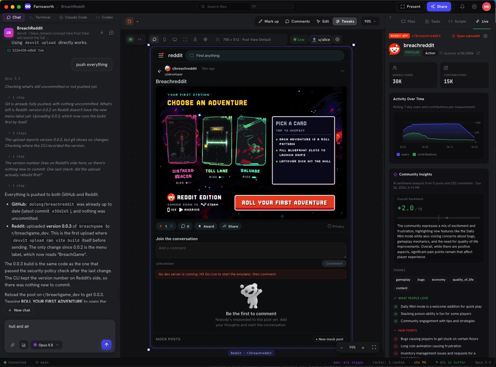
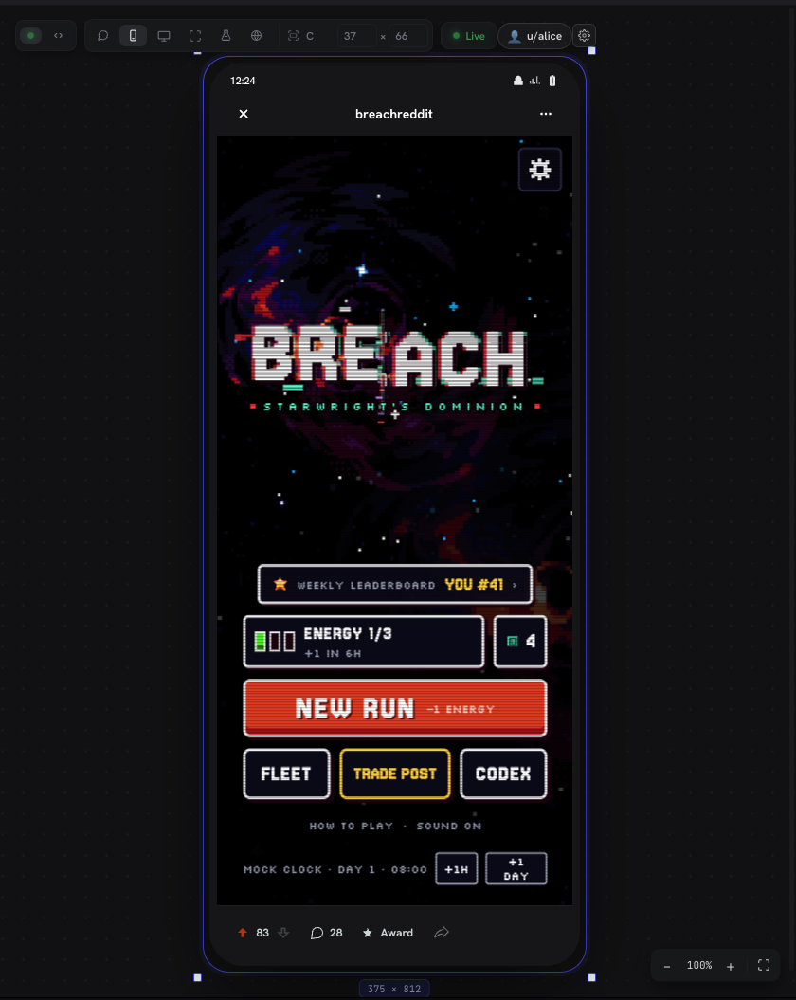
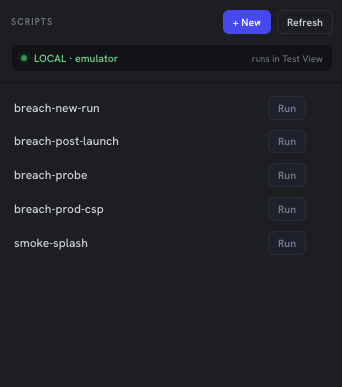
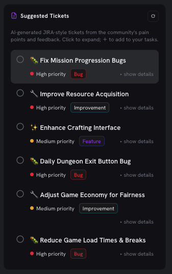
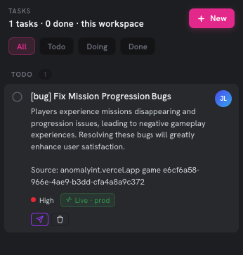
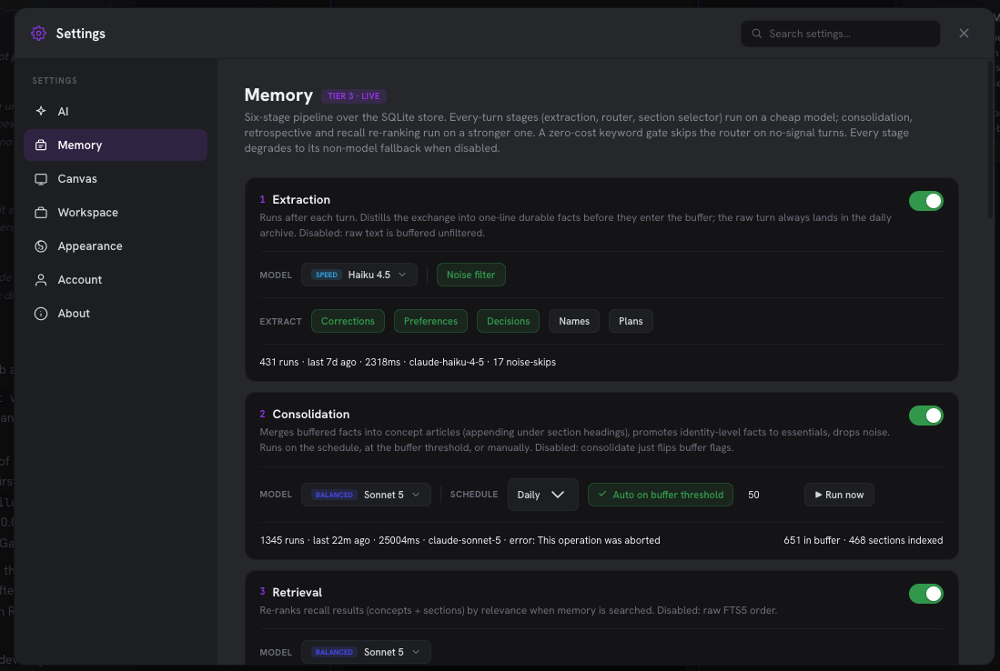
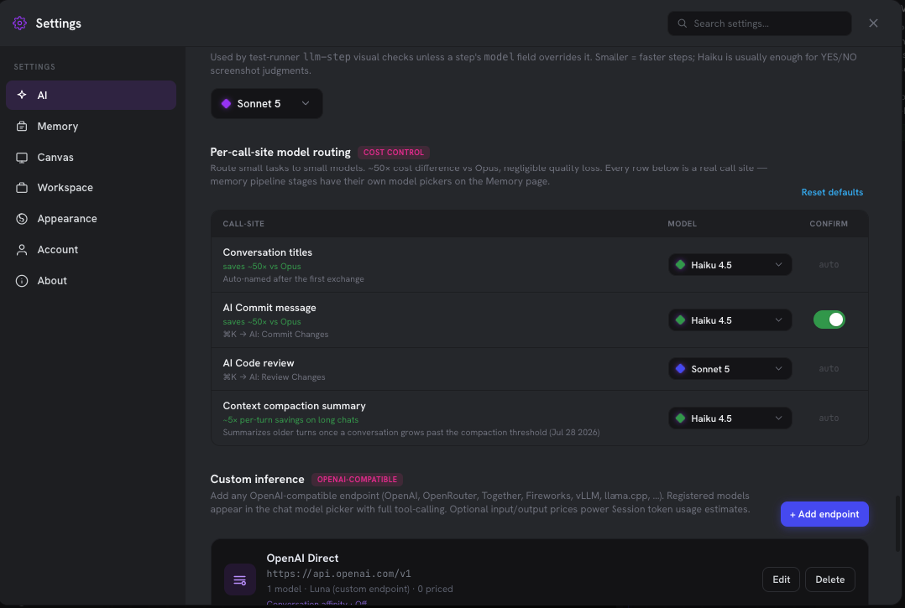

# Farnsworth

**An AI-native IDE for building Reddit games.**

Farnsworth puts an AI agent, a live Reddit preview, a test runner, and your game's real community data in one desktop app. You chat with the agent, it edits your Devvit project, and you watch the result render inside a faithful Reddit post, on the user you choose, without leaving the window.

[Download for macOS](https://farnsworth.tv) · [Docs](https://farnsworth-docs.vercel.app)



---

## The layout

| Region | What lives there |
| --- | --- |
| **Left: agent panel** | Chat with the Farnsworth agent, plus tabs for **Terminal**, **Claude Code**, and **Codex**, each scoped to the open project folder |
| **Center: canvas** | The live game preview, with **Mark up**, **Comments**, **Edit**, and **Tweaks** modes and a zoomable frame |
| **Right: project panel** | **Files**, **Tasks**, **Scripts**, and **Live** (community analytics) |
| **Status bar** | Connection, git branch, memory pipeline stages, model routing, context usage, memory buffer, active model |

---

## Chat agent

The chat agent runs a full tool loop against your project: it reads and writes files, runs commands, drives the canvas, switches Reddit users, authors and runs tests, and searches project memory. It can ship too. Ask it to "push everything" and it commits, pushes to GitHub, and runs `devvit upload` to put a new build on your playtest subreddit, then reports exactly what changed and what didn't.

- Any model: Anthropic, OpenAI, or any OpenAI-compatible endpoint (see [AI settings](#ai-settings-and-cost-control))
- Live context meter and token counts per conversation
- Long chats are compacted automatically, so sessions can run for hours
- Results come back as rich inline cards (progress, choices, receipts), not just text

Need a different agent? The **Claude Code** and **Codex** tabs run those CLIs in a terminal rooted at the same project folder.

---

## Live Reddit preview

The canvas renders your game the way Reddit does, backed by a local **Devvit emulator**, so `npm run dev` works without a playtest session or a deploy.

- **Post View**: your inline splash inside a realistic Reddit post (header, votes, awards, share, comments), on a mock subreddit feed you can add posts to
- **Expanded view**: the full game in a phone frame, exactly as it opens on mobile

  

- **Device frames**: post, mobile, desktop, and fullscreen, with custom dimensions
- **Play as any user**: switch between test identities (`u/alice`, ...) to check per-user state, saves, and leaderboards
- **Go Live**: start the emulator and dev server from the toolbar; the server runtime, Redis-style storage, and per-user data persist across restarts
- **Mark up, Comments, Edit, Tweaks**: annotate the preview, leave review comments, edit elements in place, and tweak values without touching code

---

## Scripts: tests you can watch



The **Scripts** tab lists your project's tests (`.farnsworth/devvit-tests/*.json`). Hit **Run** and the test drives the real game in the canvas while you watch: clicks, waits, screenshots, and AI visual checks ("does the hull meter show 3?"). Runs can be recorded as video.

Tests are plain JSON, and the agent writes them for you. Ask "make a test that starts a new run and launches a ship" and it opens Test View, authors the steps, and runs them. Tests run against the local emulator. See [docs/tests.md](docs/tests.md).

---

## Live: your community, analyzed

The **Live** tab connects your game to real Reddit data:

- **Stats**: weekly users, contributions, and activity over time
- **Community Insights**: AI sentiment across your posts and comments, with an overall score, themes, what people love, and pain points
- **Suggested Tickets**: AI-written, JIRA-style tickets generated from that feedback, each tagged Bug, Improvement, or Feature with a priority

<p>
  
  
</p>

Click **+** on a ticket and it becomes a **Task**, carrying its source (game id) and a `Live · prod` tag. Tasks are tracked per workspace (Todo / Doing / Done), and the send button hands one straight to the agent to work on. Player feedback becomes a fix in a few clicks.

---

## Memory that learns your project



Farnsworth remembers your project across sessions using a **six-stage pipeline** over a local SQLite store:

1. **Extraction**: after each turn, distills the exchange into one-line durable facts (corrections, preferences, decisions, names, plans), with a noise filter
2. **Consolidation**: merges buffered facts into concept articles, promotes key facts, and drops noise, on a schedule or when the buffer fills
3. **Retrieval**: re-ranks recall results by relevance when memory is searched
4. **Router**, **section selector**, and **retrospective**: decide what context each turn actually needs

Every-turn stages run on a cheap model and heavier stages on a stronger one. A zero-cost keyword gate skips the router on turns with no signal. Each stage can be toggled, re-modeled, or run manually, and falls back to a no-model path when disabled. Run counts, timings, and errors are shown per stage.

---

## AI settings and cost control



- **Per-call-site model routing**: every background AI call (conversation titles, commit messages, code review, context compaction) gets its own model picker. Sending small jobs to small models saves roughly 50x versus a frontier model, with optional confirm-before-run
- **Custom inference**: add any OpenAI-compatible endpoint (OpenAI, OpenRouter, Together, Fireworks, vLLM, llama.cpp, ...). Registered models show up in the chat picker with full tool calling, and optional per-token prices feed session cost estimates
- **Visual-check model**: choose which model judges screenshots in tests

---

## Also included

- **Command palette** (`⌘K`), including AI: Commit Changes and AI: Review Changes
- **Monaco code editor** with file search
- **Present** and **Share** for showing a build
- **Companion app**: follow and steer the agent from your phone
- **Auto-updates** through signed GitHub releases

---

## Run from source

```bash
git clone https://github.com/dolong/farnsworth-app.git
cd farnsworth-app
npm install
npm start
```

Requires Node 22 on macOS. `npm install` pulls Electron (~150 MB on first run).

### Repo map

```
main.js              Electron main: windows, IPC, inference, agent tools, Prod
preload.js           window.farnsworth bridge (see docs/ipc-surface.md)
db.js                SQLite: memory, tasks, settings
src/app.js           Renderer: chat, canvas, panels, settings
devvit-emulator/     Local Devvit runtime (server runner, storage)
farnsworth-test.py   CDP test runner behind Scripts / Test View
docs/                Wiki: tests, IPC surface, live-preview contract, memory pipeline
AGENT-TOOLS.md       Chat agent tool inventory
DEVVIT-TESTS.md      Test format reference (read by the agent)
```

Releases are built by GitHub Actions on `v*` tags (`.github/workflows/build.yml`).

## License

MIT
